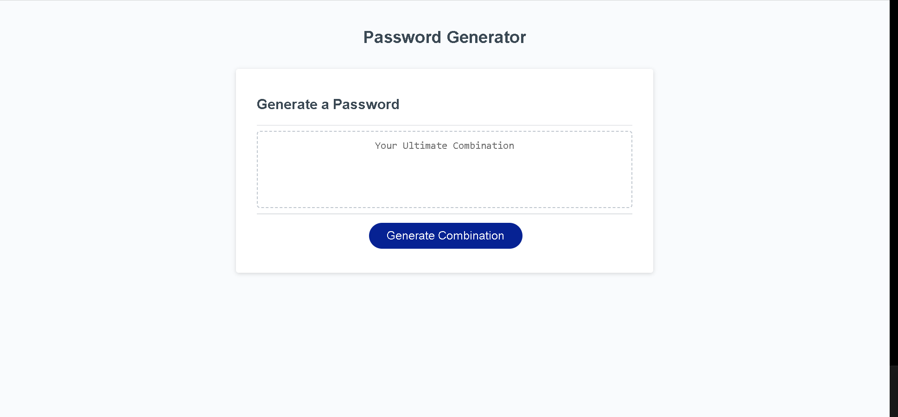

# Ultimate Combination

## Description

This project was develop with one thing in mind, that was to provide the ultimate password generator for individual who are looking for a quick and simple tool to create a secure and safe password. Creating this application really shed light that this project is far from completed. During my research I discovered a more secure way to generate a password that I will be sure to implement later on.

## Installation

No intallation needed. 

## Usage

Simply click the blue button label "Generate Combination" and start by answering the following prompt.

To add a screenshot, create an `assets/images` folder in your repository and upload your screenshot to it. Then, using the relative file path, add it to your README using the following syntax:

## Credits
Big help:
https://stackoverflow.com/questions/38620152/pick-a-random-letter-from-string-in-javascript

## License

MIT Licenses